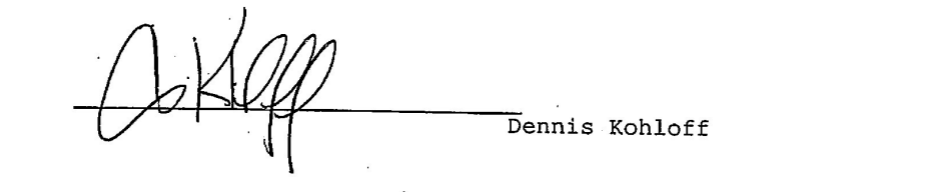

# Articles Of Incorporation Of Shadows At Swan Lake Homeowners Association

The undersigned, acting as incorporator of a corporation under the Washington Non-Profit Miscellaneous and Mutual Corporations Act (the "Act"), adopts the following Articles of Incorporation for the Shadows at Swan Lake Homeowners Association.

# Article 1. Name
The name of this corporation shall be SHADOWS AT SWAN LAKE HOMEOWNERS ASSOCIATION (the "Association").

# Article 2. Duration
The duration of this Association shall be perpetual.

# Article 3. Purposes And Powers

## 3.1 Purposes.
The purpose for which the Association is organized is to provide an entity for the operation of a residential development known as Shadows at Swan Lake located in King County, Washington and described on Exhibit A hereto (the "Property"). The Association shall engage in all such activities as are incidental or conducive to the attainment of the objectives of the Association and all activities which are permitted to be done by a nonprofit corporation under any laws that may now or hereafter be applicable or available to this Association.

## 3.2 Powers.
The powers of this Association shall be subject to and shall be exercised in accordance with the provisions of the Declaration and Covenants, Conditions, Restrictions, Easements, and Reservations for Shadows at Swan Lake, recorded with the Department of Records and Elections of King County, Washington, as it may from time to time be amended (the "Declaration"). The powers of this Association shall include, without limitation, the following:

### 3.2.1
The power to perform all duties and obligations of the Association as set forth in the Declaration;

### 3.2.2
The power to fix, levy, collect and enforce payment by any lawful means of all charges or assessments made pursuant to the Declaration and to pay all expenses in connection therewith and all office or other expenses incident to the conduct of the business of the Association, including all licenses, taxes and governmental charges levied or imposed against the property of the Association;

### 3.2.3
The power to acquire by gift pledge or otherwise, own, hold, improve, build upon, operate, maintain, convey, sell, lease, transfer, dedicate for public use or otherwise dispose of real or personal property in connection with the affairs of the Association;

### 3.2.4
The power to borrow money, and with the consent of at least 67% of the voting power of the Association, mortgage, pledge, encumber or hypothecate any or all of its real or personal property as security for money borrowed or debts incurred;

### 3.2.5
With the consent of at least 67% of the voting power of the Association, the power to dedicate, sell, transfer, all or any part of the common area of the property to any public agency, authority. or utility for such purposes and subject to such conditions as may be agreed upon by the Board;

### 3.2.6
The power to participate in mergers and consolidations with other non-profit corporations for the same purposes, provided that any such merger or consolidation shall have the consent of at least 67% of the voting power of the Association;

### 3.2.7
The power to have or exercise any and all powers, rights and privileges which a corporation exercised under the Act may now or hereafter have or exercise; and

### 3.2.8
The power to enter into management contracts as specified in the Declaration.

### 3.2.9
With the consent of at least 51% of the voting power of the Association, the power to grant easements to private utilities within the 10 foot easement strip along all front property lines as provided in Section 2.5 of the Declaration.

# Article 4. Members
The Association shall have one class of members, which shall consist of the Persons owning a fee interest in any of the Lots in the Property. The Persons constituting the Owners of a Lot shall become members of the Association automatically upon taking title to a Lot, and cease to be members of the Association upon conveying their interest in the Lot (including by real estate contract) to another. The rights and responsibility of members of the Association are set forth in detail in the Declaration. Ownership of a fee interest in a Lot shall be the sole qualification for membership in the Association.

# Article 5. Distribution Of Assets Upon Dissolution Or Liquidation

## 5.1 Consent Required for Dissolution.
The Association may be dissolved upon the written approval of Persons holding 90% of the voting power of the Association.

## 5.2 Distribution.
Upon dissolution of the Association, the assets, both real and personal of the Association, shall be granted, conveyed and assigned to any non-profit corporation, association, trust or other organization to be devoted to purposes and uses that would most nearly reflect the purposes and uses to which they were required to be devoted by the Association.

# Article 6. Developer'S Rights
All the rights, powers and functions of the Association, or the Board of Directors, including the right to do any actions which require the approval of a majority or supermajority of the voting power of the Association, may at the option of Declarant be exercised and or performed by Declarant until the Transition Date.

# Article 7. Registered Office And Agent
The address of the initial registered office of this Association is:

> 14410 Bel-Red Road, Suite 200
> Bellevue, WA 98007

The name of its initial registered agent at such address is `Dennis Kohloff`.

# Article 8. Directors
The number of Directors of this Association shall be fixed by the bylaws and may be increased or decreased from time to time in the manner specified therein. The initial board of directors shall consist of three Directors appointed by Declarant. The names and address of the persons who shall serve as Directors until the first meeting of the member(s) and until their successors are appointed or elected unless they resign or are removed are:

* Dennis Kohloff 14410 Bel-Red Road, Suite 200 Bellevue, WA 98007
* Donald Kline   14410 Bel-Red Road, Suite 200 Bellevue, WA 98007
* Donald Jasper  14410 Bel-Red Road, Suite 200 Bellevue, WA 98007

# Article 9. Indemnification
Each Director, committee member, officer of the Association, Declarant and the Managing Agent (collectively and individually, "Indemnitee") shall be indemnified by the Association against all expenses and liabilities, including attorneys' fees, reasonably incurred or imposed in connection with any proceeding, dispute, or settlement thereof to which Indemnitee may be a party, or in which Indemnitee may become involved, by reason of any individual Indemnitee's status as Association committee member, Association officer, Director or Managing Agent (whether or not the individual Indemnitee holds such position at the time such expenses or liabilities are incurred). The indemnification set forth in the preceding sentence shall not apply: (1) to the extent such expenses and liabilities are covered by insurance; (2) with regard to acts or omissions that involve intentional misconduct by an Indemnitee, or a knowing violation of law by an Indemnitee; or (3) with regard to any transaction from which an Indemnitee will personally receive a benefit in money, property, or services to which the Indemnitee is not legally entitled. If such liability and expense arise out of the concurrent negligence of Indemnitee and Association, this indemnity shall still apply, but if specifically required by statute, then this indemnification shall apply only to the extent Indemnitee's liability arises out of the negligence of Association, or out of negligence of a third party.

# Article 10. Loans To Directors And Officers Prohibited
No loans shall be made by the Association to its Directors or officers. The Directors of the Association who vote for or assent to the making of a loan to a Director or an officer of the Association and any officer or officers participating in the making of such loan shall be jointly and severally liable to the Association for the amount of such loan until the repayment thereof.

# Article 11. Amendment Of Articles
Declarant may amend these Articles at any time before the Transition Date. After the Transition Date, the power to adopt, amend or repeal the Articles of this Association shall be limited as provided in Article 14 of the Declaration for amendments to the Declaration; provided further that no material amendment to these Articles shall be made unless thirty (30) days written notice of the proposed material amendment is given by the Association to institutional holders of First Mortgages or equivalent liens who have requested notice thereof in writing.

# Article 12. Definitions And Interpretations
All terms used in these Articles shall have the same meaning as in the Declaration unless specifically indicated to the contrary. In the case of any conflict between any of these Articles and the By-Laws, these Articles shall control. In the case of any conflict between these Articles and the Declaration, the Declaration shall control.

# Article 13. Incorporator
The name and address of the incorporator is:
Dennis Kohloff
14410 Bel-Red Road, Suite 200 Bellevue, WA 98007

IN WITNESS WHEREOF, the in corporator has signed these articles in duplicate as of this __ day of __ ; 19__.

Dennis Kohloff
